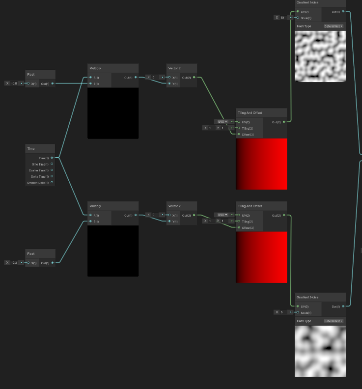
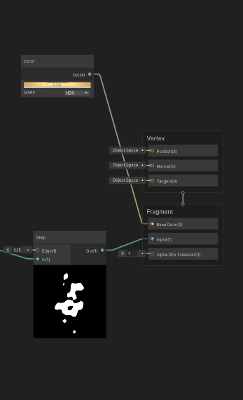
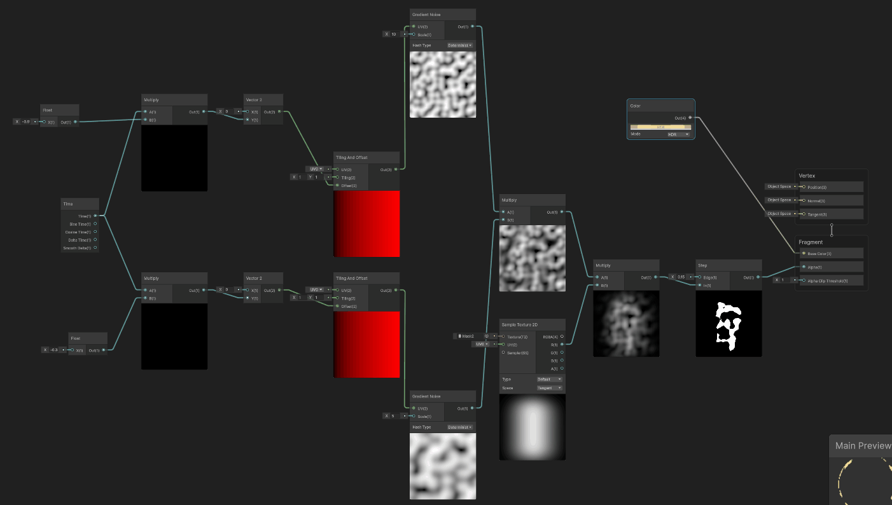

# 🔥 Shader_URP_Fire1

Unity Universal Render Pipeline (URP) に対応した「炎エフェクト」の Shader Graph 実装サンプルです。リアルタイム炎表現の基礎を学びたい方、Shader GraphからHLSLへの落とし込みを目指す中級者に向けて構成されています。
このプロジェクトでは、以下のような炎エフェクトをShader Graphで実装しています。

<p align="center">
  
</p>

## 🎯 このプロジェクトについて

本プロジェクトは、以下の目的で制作されました：

- Shader Graph だけで炎エフェクトを再現する技術の理解  
- 時間・ノイズ・UV変形による視覚効果の統合例

## 🧪 動作環境

- Unity 2022.3 以降（Unity 6 対応確認済み）  
- URP 12 以降（URPテンプレートプロジェクトをベースに構築）

## 🏗️ プロジェクト構成
```
Shader_URP_Fire1/
├── Assets/
│ ├── Scenes/
│ │ └── SampleScene.unity # 炎の動作確認用シーン
│ ├── Shaders/
│ │ └── Fire1.shadergraph # Shader Graph 本体
│ ├── Image/
│ │ └── Mask2.tga # 周囲を消し込みつつ炎のシルエットを作る
│ └── Materials/
│ └── Fire1.mat # 炎マテリアル設定済み
├── ProjectSettings/
└── Packages/
```

## 🔧 使い方

1. このリポジトリを Clone または Download  
2. Unity Hub から本プロジェクトを開く（URP テンプレートとして認識されます）  
3. `Scenes/SampleScene.unity` を開いて動作確認  
4. Shader Graph の `Fire1.shadergraph` を開いてノード構成を確認  

## 💡 技術ポイント

- 2つの「Gradient Noise ノード」を作成し、それぞれが +Y 方向にスクロールするようにノードを接続します。  
  それぞれのスクロール速度は異なる値に設定します（速い方が細かいノイズになります）。
  


- 2つのノイズを「Multiply ノード」で乗算合成します。  
- 合成したノイズを「Step ノード」につなげて2値化します。  
- GameObject に貼り付けた際に、四角形の境界が目立ってしまう問題を回避するため、周囲を消すマスクを使用します。  
  「Sample Texture 2D ノード」を使い、「Mask2 テクスチャ」をアサインします。  


- この「Mask2 ノード」と、2つのノイズを合成した「Multiply ノード」をさらに「Multiply ノード」で乗算し、「Step ノード」につなげます。  
- Mask2 テクスチャは下から上へ暗くなるグラデーション構造になっているため、ノイズと合成することで「上に行くほど暗くなる」ノイズが生成されます。  
- 最終的に「Step ノード」で2値化すると、炎が上にいくほど徐々にちぎれて消えていくような自然な表現になります。



- ShaderGraph全体です。




## 📜 ライセンス

このプロジェクトは [MIT License](LICENSE) のもとで公開されています。

---

👤 Author: [@tkagawa218](https://note.com/easy_snipe8792)  

✉  Mall:   [Adress](tkagawa218@gmail.com)  
            
🌐 note記事: [準備中]()
